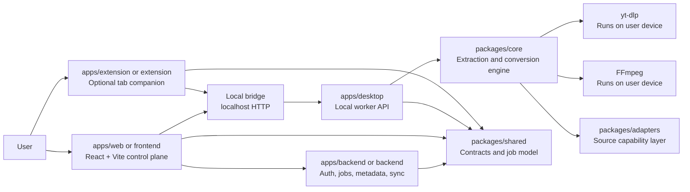

# SignalThief

SignalThief is being refactored into a local-first media workflow. The web app remains the SaaS control plane, the desktop worker owns extraction and conversion, the backend coordinates jobs and account data, and the Chrome extension is an optional companion.

The current Phase 1 keeps the existing web flow working while introducing the new package boundaries and local worker protocol.

## Target Architecture



## Repository Layout

Phase 1 keeps existing app folders in place for compatibility and adds the target package boundaries:

```text
signalthief/
├── frontend/                    # Existing React + Vite web app
├── backend/                     # Existing Fastify backend, now compatibility plus orchestration
├── extension/                   # Existing Manifest V3 companion
├── apps/
│   └── desktop/                 # Local worker prototype
├── packages/
│   ├── shared/                  # API contracts, job states, media types, device protocol
│   ├── core/                    # yt-dlp, FFmpeg, subprocess, local media engine
│   └── adapters/                # Source adapter contracts
├── docs/                        # Migration, pairing, packaging, extension, deployment docs
└── shared/                      # Temporary compatibility export for old imports
```

The long-term target is:

```text
apps/web
apps/backend
apps/desktop
apps/extension
packages/shared
packages/core
packages/adapters
packages/ui
```

## What Changed In Phase 1

### Shared contracts

Shared media types, job states, typed errors, device status, and local bridge contracts now live in `packages/shared/src`. The old `shared/types.ts` file remains as a compatibility export.

### Core extraction boundary

The yt-dlp and FFmpeg wrappers moved out of `backend/src/services` into `packages/core/src`. Backend service files now re-export the core implementation so existing routes do not break.

### Source adapter layer

`packages/adapters/src` defines source adapter capabilities. UI components should not contain platform-specific logic. New source support should be added behind adapter contracts.

### Desktop worker

`apps/desktop` exposes a local HTTP bridge on `127.0.0.1:43173` by default. It supports health checks, pairing, local extraction, local download, local jobs, and cancellation.

### Backend orchestration

The backend now exposes `/api/jobs` for orchestration. Existing `/api/extract` and `/api/download` still work, but they are marked as compatibility routes and point clients toward local desktop execution.

## Development

Install existing dependencies:

```bash
cd backend
npm install

cd ../frontend
npm install
```

Run backend and web:

```bash
cd backend
npm run dev
```

```bash
cd frontend
npm run dev
```

Run the local desktop worker:

```bash
cd apps/desktop
npm install
npm run dev
```

Open the web app at `http://localhost:5173`.

## Local Device Pairing

The local worker uses a short-lived pairing flow:

1. Client calls `POST /pair/start` with `clientName` and `origin`.
2. Worker returns `pairingId`, `pairingCode`, and `expiresAt`.
3. Client confirms with `POST /pair/confirm`.
4. Worker returns a short-lived bearer token.
5. Protected local routes require `Authorization: Bearer <token>`.

Detailed pairing notes are in [docs/local-device-pairing.md](docs/local-device-pairing.md).

## Environment Variables

### Backend

| Variable | Default | Purpose |
| --- | --- | --- |
| `PORT` | `3001` | Backend API port |
| `HOST` | `0.0.0.0` | Backend bind host |
| `NODE_ENV` | `development` | Runtime mode |
| `LOG_LEVEL` | `info` | Backend log level |
| `CACHE_MAX_AGE` | `3600000` | Temporary cache TTL in milliseconds |
| `CORS_ORIGINS` | Built-in local origins | Extra comma-separated web origins |
| `YTDLP_COOKIES_FILE` | unset | Deprecated server compatibility route only |
| `YT_DLP_PATH` | `yt-dlp` | Deprecated server compatibility route only |
| `FFMPEG_PATH` | `ffmpeg` | Deprecated server compatibility route only |

### Frontend

| Variable | Default | Purpose |
| --- | --- | --- |
| `VITE_API_URL` | local backend in development | Backend control plane URL |
| `VITE_DESKTOP_BRIDGE_URL` | `http://127.0.0.1:43173` planned | Local desktop bridge URL for Phase 2 |

### Desktop Worker

| Variable | Default | Purpose |
| --- | --- | --- |
| `SIGNALTHIEF_DESKTOP_PORT` | `43173` | Local worker port |
| `SIGNALTHIEF_DESKTOP_HOST` | `127.0.0.1` | Local worker bind host |
| `SIGNALTHIEF_DEVICE_ID` | `local-dev-device` | Stable local device id for development |
| `SIGNALTHIEF_DEVICE_NAME` | `SignalThief Desktop Worker` | Display name |
| `YT_DLP_PATH` | `yt-dlp` | Local yt-dlp executable |
| `FFMPEG_PATH` | `ffmpeg` | Local FFmpeg executable |

## Deprecated Backend Responsibilities

The backend should no longer be the long-term home for:

- End-user media extraction from third-party sites.
- Long-running user download streams.
- Browser-session-dependent requests.
- Server-side user cookie use for extraction.
- FFmpeg conversion for normal user workflows.
- Source-specific extraction behavior.

These responsibilities move to `apps/desktop` and `packages/core`.

## Testing

Run backend type checks:

```bash
cd backend
npm run build
```

Run shared and adapter tests:

```bash
cd backend
npm run test
```

Run frontend build:

```bash
cd frontend
npm run build
```

## More Docs

- [Migration plan](docs/migration-plan.md)
- [Local device pairing](docs/local-device-pairing.md)
- [Packaging](docs/packaging.md)
- [Deployment](DEPLOYMENT.md)
- [Extension setup](docs/extension-setup.md)
- [Code review notes](code_review.md)
