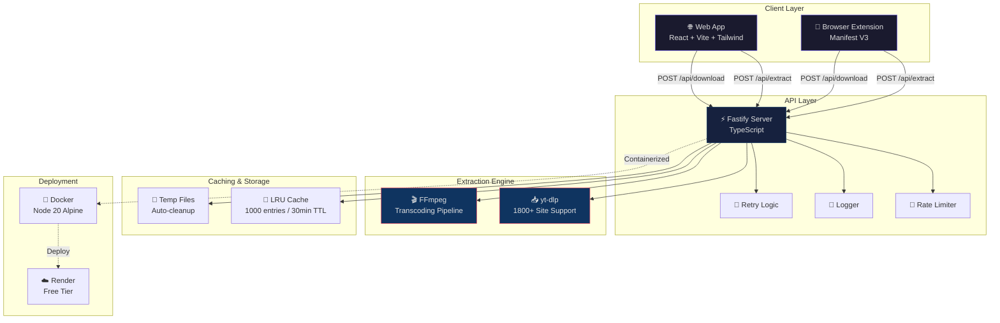
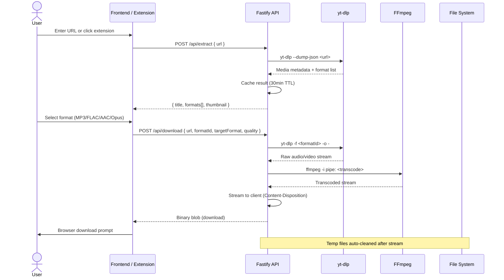

# 🎵 SignalThief

> **Ad-free, bloat-free media extractor.** Download audio & video from any URL — YouTube, SoundCloud, Bandcamp, Vimeo, Twitter/X, Instagram, TikTok, and 1800+ sites. No ads. No spyware. Just media.

[](LICENSE)
[](https://www.typescriptlang.org/)
[](https://react.dev/)
[](https://fastify.dev/)
[](https://developer.chrome.com/docs/extensions/mv3/)

---

## 📦 Architecture



## 🔄 Data Flow



## 🏗️ Project Structure

```
signalthief/
├── backend/                    # Fastify API server
│   ├── src/
│   │   ├── index.ts           # Server entry point (CORS, rate limit, routes)
│   │   ├── routes/
│   │   │   ├── extract.ts     # POST /api/extract — yt-dlp JSON extraction
│   │   │   └── download.ts    # POST /api/download — FFmpeg streaming download
│   │   ├── services/
│   │   │   ├── yt-dlp.ts      # yt-dlp CLI wrapper with auto-install
│   │   │   ├── ffmpeg.ts      # FFmpeg transcoding & stream pipeline
│   │   │   └── cache.ts       # LRU in-memory cache
│   │   └── lib/
│   │       ├── errors.ts      # Typed error classes (AppError)
│   │       ├── logger.ts      # Structured JSON logger
│   │       ├── rate-limit.ts  # Token-bucket rate limiter
│   │       └── retry.ts       # Exponential backoff retry logic
│   ├── Dockerfile             # Production Docker image
│   └── package.json
│
├── frontend/                   # React web application
│   ├── src/
│   │   ├── App.tsx            # Main app with state management
│   │   ├── components/
│   │   │   ├── Header.tsx     # Navigation header
│   │   │   ├── UrlInput.tsx   # URL input with paste support
│   │   │   ├── MediaCard.tsx  # Format table with download buttons
│   │   │   └── Footer.tsx     # Status bar footer
│   │   ├── index.css          # Tailwind + Terminal Brutalist theme
│   │   └── main.tsx           # React entry point
│   ├── index.html
│   ├── vite.config.ts
│   ├── tailwind.config.js
│   └── package.json
│
├── extension/                  # Chrome browser extension
│   ├── manifest.json          # Manifest V3 configuration
│   ├── background/
│   │   └── service-worker.js  # Media interception & download handling
│   ├── content/
│   │   └── media-detector.js  # Page injection — finds media elements
│   └── popup/
│       ├── popup.html         # Extension popup UI
│       ├── popup.css          # Dark theme styles
│       └── popup.js           # Popup logic & API communication
│
├── shared/
│   └── types.ts               # Shared TypeScript types (MediaFormat, etc.)
│
├── render.yaml                # Render.com free-tier deployment config
├── docker-compose.yml         # Local Docker orchestration
├── .gitignore
└── README.md
```

## 🚀 Quick Start

### Prerequisites

- **Node.js** ≥ 20
- **npm** ≥ 9
- **FFmpeg** (auto-detected; install if missing: `choco install ffmpeg` / `brew install ffmpeg` / `apt install ffmpeg`)
- **yt-dlp** (auto-installed by backend on first run)

### 1. Clone & Install

```bash
git clone https://github.com/Erebuzzz/signalthief.git
cd signalthief

# Backend
cd backend
npm install

# Frontend
cd ../frontend
npm install
```

### 2. Run Development Servers

```bash
# Terminal 1 — Backend API (port 3001)
cd backend
npm run dev

# Terminal 2 — Frontend Dev Server (port 5173)
cd frontend
npm run dev
```

Open **http://localhost:5173** in your browser.

### 3. Load Browser Extension

1. Navigate to `chrome://extensions`
2. Enable **Developer mode** (top-right toggle)
3. Click **Load unpacked**
4. Select the `extension/` folder
5. Pin the extension to your toolbar

### 4. Download Media

**Via Web App:**
1. Paste any media URL (YouTube, SoundCloud, etc.)
2. Click **EXTRACT**
3. Select your desired format/quality
4. Click **GET** to download

**Via Extension:**
1. Navigate to a page with audio/video
2. Click the extension icon
3. Auto-detected media appears in the "Detected Media" tab
4. Or paste a URL in the "Paste URL" tab
5. Choose format and download

## 🎛️ Supported Formats

| Category | Formats |
|----------|---------|
| **Audio** | MP3 (recommended), AAC, FLAC (lossless), Opus, OGG Vorbis, WAV (uncompressed), M4A, Best (original) |
| **Video** | MP4, WebM, MKV |

## 🐳 Docker Deployment

```bash
# Build and run with Docker Compose
docker-compose up -d

# Or build individually
cd backend
docker build -t signalthief-api .
docker run -p 3001:3001 signalthief-api
```

## ☁️ One-Click Deploy to Render

The project includes a [`render.yaml`](render.yaml) configured for **Render's free tier**:

1. Fork this repository on GitHub
2. Connect your fork to [Render](https://render.com)
3. Render auto-detects `render.yaml` and creates the web service
4. Done! Your API is live at `https://signalthief-api.onrender.com`

> **Note:** Free tier instances spin down after inactivity. First request may take 30-60s to wake.

## 🛠️ Tech Stack

| Layer | Technology |
|-------|-----------|
| **Backend** | Fastify (Node.js), TypeScript 5.3 |
| **Frontend** | React 18, Vite, Tailwind CSS 3 |
| **Extension** | Chrome Manifest V3, Vanilla JS |
| **Extraction** | yt-dlp (1800+ sites) |
| **Transcoding** | FFmpeg |
| **Containerization** | Docker, Docker Compose |
| **Deployment** | Render (free tier) |
| **Shared Types** | TypeScript interfaces in `shared/` |

## 🧪 Development

```bash
# TypeScript type-checking
cd backend && npx tsc --noEmit
cd frontend && npx tsc --noEmit

# Build for production
cd frontend && npm run build    # Output: frontend/dist/
cd backend && npm run build     # Output: backend/dist/

# Lint (if configured)
npm run lint
```

## 📄 License

MIT © [Erebuzzz](https://github.com/Erebuzzz)

---

<p align="center">
  <sub>Built with ❤️ · No ads · No bloat · Just media</sub>
</p>